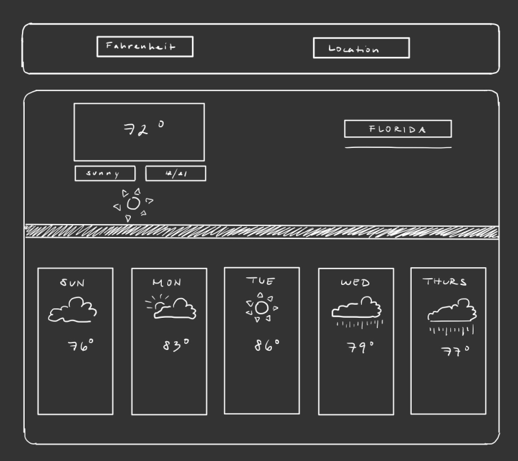
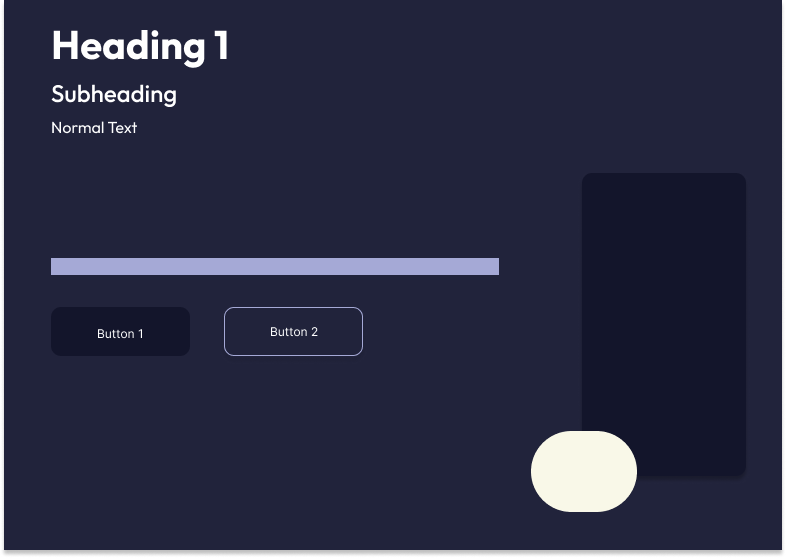
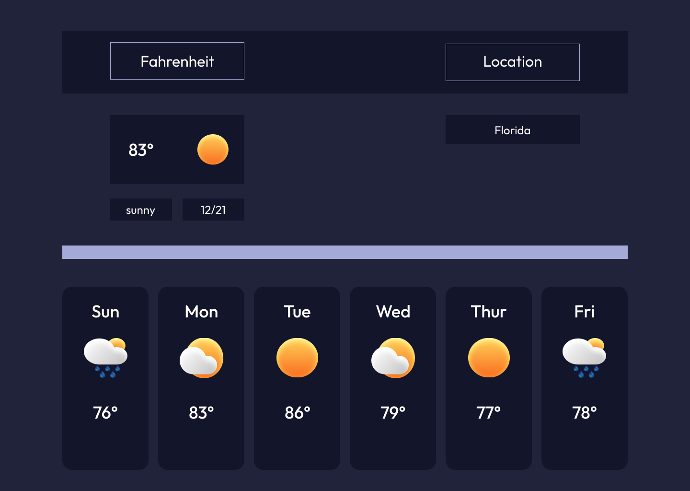

# weather-app
This is a personal project. My goal is to learn how to integrate the use of API into my projects and to practice how to design the UI using Figma. I do not own the weather icons images, credits goes to Tiru19 from reddit.

## Wireframe

## Color Scheme

## Mockup

## For a quick setup (You cloned this repo):
1. npm init -y
2. npm install -D webpack webpack-cli html-webpack-plugin style-loader css-loader html-loader webpack-dev-server

## If you want to use this template but you did not clone it:
1. npm init -y
2. npm install --save-dev webpack webpack-cli
3. npm install --save-dev html-webpack-plugin
4. npm install --save-dev style-loader css-loader
5. npm install --save-dev html-loader
6. npm install --save-dev webpack-dev-server
7. touch webpack.config.js
8. mkdir src && touch src/index.js src/another.js
9. touch src/template.html
10. touch src/styles.css
11. *optional* npm install -D babel-loader @babel/core @babel/preset-env webpack

## To host, 
npx webpack serve
    or
npm run dev

## Open it on 
http://localhost:8080/

## Your package.json should have these in the script: 

"scripts": {
    "test": "echo \"Error: no test specified\" && exit 1",
    "build": "webpack",
    "dev": "webpack serve",
    "deploy": "git subtree push --prefix dist origin gh-pages"
},

## Your webpack.config.js should already contain: 

const path = require("path");
const HtmlWebpackPlugin = require("html-webpack-plugin");

module.exports = {
  mode: "development",
  entry: "./src/index.js",
  output: {
    filename: "main.js",
    path: path.resolve(__dirname, "dist"),
    clean: true,
  },
  devtool: "eval-source-map",
  devServer: {
    watchFiles: ["./src/template.html"],
  },
  plugins: [
    new HtmlWebpackPlugin({
      template: "./src/template.html",
    }),
  ],
  module: {
    rules: [
      {
        test: /\.css$/i,
        use: ["style-loader", "css-loader"],
      },
      {
        test: /\.html$/i,
        loader: "html-loader",
      },
      {
        test: /\.(png|svg|jpg|jpeg|gif)$/i,
        type: "asset/resource",
      },
      { // optional
        test: /\.(?:js|mjs|cjs)$/,
        exclude: /node_modules/,
        use: {
          loader: 'babel-loader',
          options: {
            targets: "defaults",
            presets: [
              ['@babel/preset-env']
            ]
          }
        }
      }
    ],
  },
};

## To deploy on GitHub Pages:
1. make a new branch to deploy from (git branch gh-pages)
2. commit any remaining work and push
3. git checkout gh-pages && git merge main --no-edit
4. npx webpack or npm run build
5. git add dist -f && git commit -m "deployment commit"
6. git subtree push --prefix dist origin gh-pages
7. git checkout main